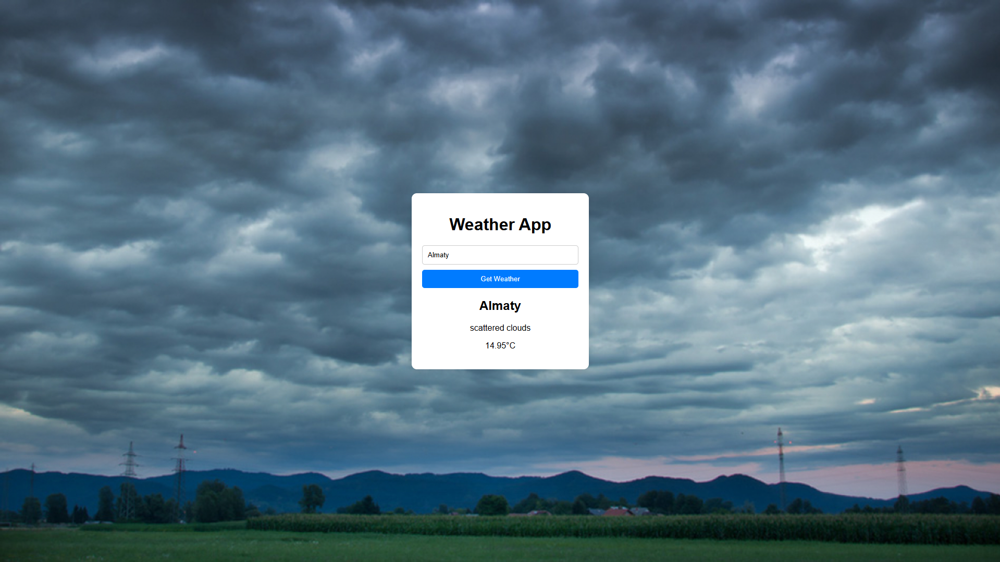

# Weather App

## Description

This is a simple weather application that allows users to get the current weather information for a specified city.

## Screenshot

## Installation

1. Clone the repository.
2. Install dependencies.
3. Run the application.

## Usage

- Open the app in your browser.
- Enter a city name and click "Get Weather" to see the weather information.
